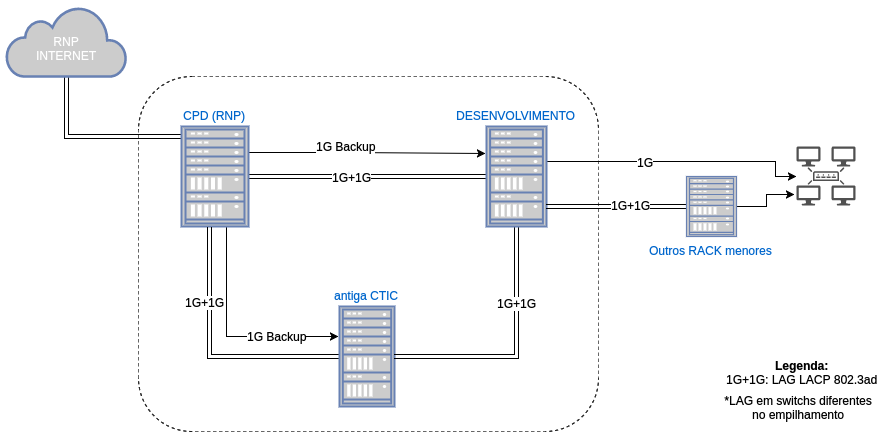
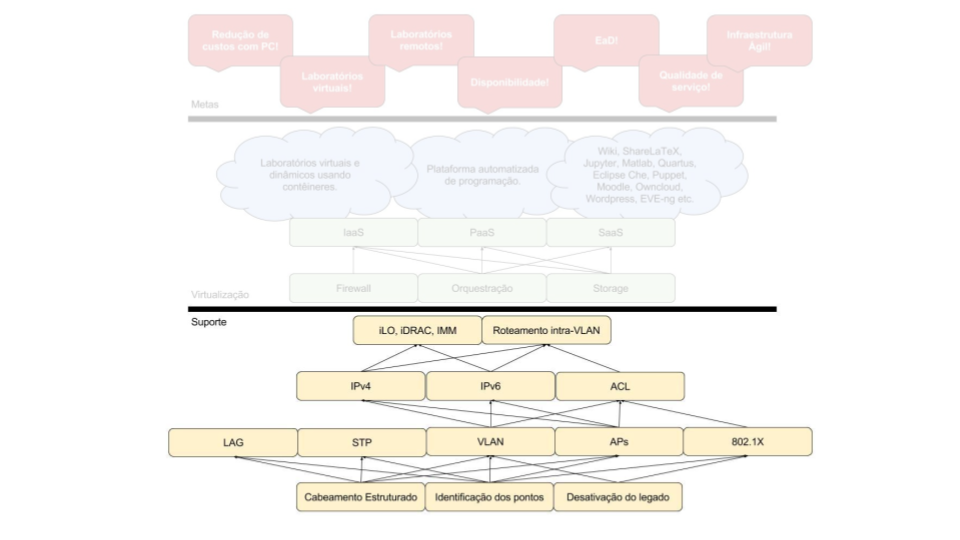
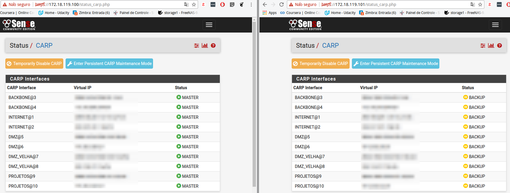
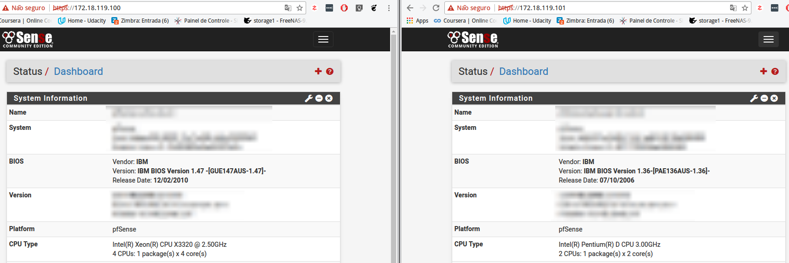

# Infraestrutura de TI do Câmpus São José

A CTIC atualmente administra em sua infra:

* 14 Servidores físicos
* 37 Switches gerenciáveis + alguns não gerenciáveis
* Firewall PFSense com redundância ativa de hardware 
* 25 APs Cisco
* 380 Computadores
* Central telefônica +/- 70 Ramais
* +30 Servidores Virtuais (Wiki, armazenamento, página web, Câmeras...)

Em 2016 começamos vários projetos para implementar técnicas de redundância nas várias camadas na nossa infraestrutora. Almejamos atingir um alto nível de maturidade, segurança e estabilidade da infra, assim daremos suporte a outros projetos relacionados como por exemplo a mudança na forma de como provemos e administramos nossos serviços.

Foram constatados vários problemas como:

* Sem redundância de 
* * firewall (1 Cisco ASA)
* * servidor de arquivos
* * do core switch
* * dos virtualizadores
* Vários switches não gerenciáveis
* Sem documentação da infra
* Muito cabeamento  antigo (morto) nas calhas e racks
* Cobertura WIFI com problemas
* Sem gerenciamento remoto dos servidores
* Identificação do cabeamento estruturado desatualizada

### Infra anterior/atual(problemas): 

### Infra atual/futuro(soluções): 

### Segurança e estabilidade da nossa rede hoje:

### Essas ações fazem parte de um projeto macro, e implementa o suporte confiável as outras camadas.

### O que já atingimos:
* Cabeamento novo eliminando os switches críticos não gerenciáveis
* Infra/VLAN/IP/Conexões documentadas no Netbox
* Limpeza e organização dos racks e nas calhas (Km de cabos)
* Reposicionamento e instalação de AP’s
* Habilitado gerenciamento remoto (ILO, Idrac e iMM) nos servidores
* Atualização da ferramenta de monitoramento (Zabbix)
* Migração para nova faixa IPv4 e implantação do IPv6
* Implantação de VLANs baseado no GT-VLAN

#### Em implantação:
* Reorganização dos Racks centrais. (75%)
* Padronização (TCC Luana) e aplicação da identificação do cabeamento estruturado 
* Melhorar o monitoramento Zabbix
* Autenticação por porta em pontos públicos (802.1X)
* Política de acessos nas VLAN (ACL)

# HA no Firewall
Implementamos recentemente a redundância de Hardware ativa do nosso Firewall, um projeto que iniciou a um tempo quando constatamos que "o que aconteceria se nosso firewall Cisco ASA queimasse?". Dentro do IFSC alguns câmpus já utilizavam o PFSense como firewall e com excelentes resultados. Primeiramente substituimos o firewall atuala para o PFSense e recentemente implementamos uma HA no nosso firewall, ou seja, se nosso firewall master morrer, o firewall backup assume automaticamente. Utilizamos como [referência](https://doc.pfsense.org/index.php/High_Availability) a documentação oficial do PFSense.

### Vídeo da redundância funcionando:

### Firewall PFsense  Master e Backup:

### Hardwares diferentes onde rodam o PFSense:

